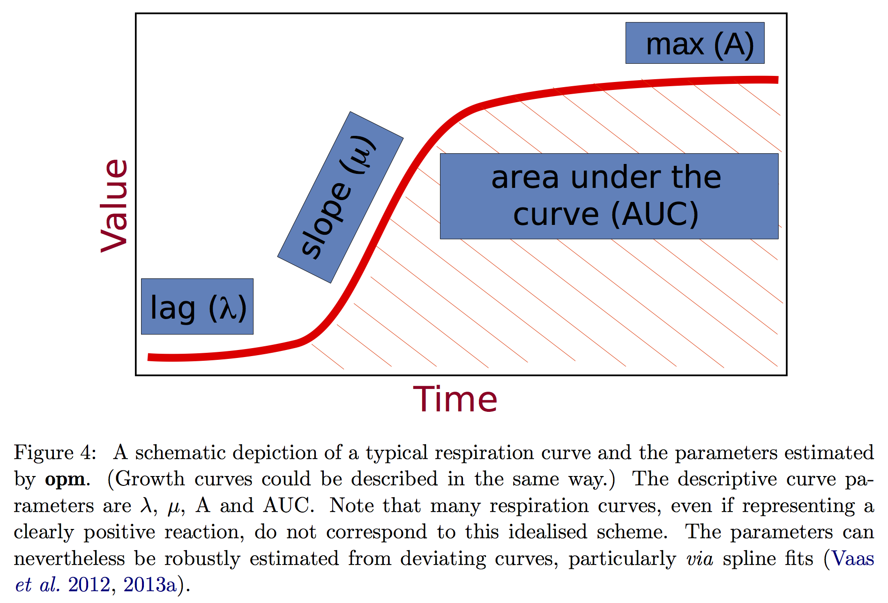

GrowthCurvesAnalysis_shinyApp
=============================

An app to analyse bacterial growth curves, using ggplot2 for plotting and

## Description

Bacterial growth in liquid medium can be investigated by measuring the change in optical density (OD600) over time (i.e. growth curve). A typical growth curve has three phases: lag, log and stationary phase (see figure). 

This app accepts user data to draw growth curves and uses the opm package to estimate curve parameters (mu, lambda, A and AUC) to represent the kinetic growth. The app was designed to deal with the most common experimental design in the lab where growth of one bacterial strain is used as a reference to compare with growth of several mutant strains; and the experiment is typically repeated 3 or more times. To compare the difference between the reference strain and each mutant, analysis of variance and Dunnett post-test are employed. 

## Usage

- The data should be blank corrected (automatically calculated by most plate readers)
- The file should be in tab-delimited format (can be exported from Excel)
- The first column contains strain/group names. Replicates of the same strain/group should have the same name
- The first row contains time variable
- The remaining row contains growth measurements (usually OD600) for growth curve, one curve per row (one replicate of a group)

### Growth curve plot

For each strain (of 3 or more replicates), the mean and standard deviation are plotted. User can choose which strains to be included in the plot. The .png image of the plot can be saved by right click on the plot and choose `Save image as...`. Alternatively, a .pdf version of the graph can be downloaded using the `Download plot (.pdf)` button at the bottom of the page. 

### Curve parameter estimation

The four parameters are estimated for each replicate of each strain.

### Statistical comparisons

Anova and Dunnett post-test are done with the option to select the reference strain to compare against. A plot of confident intervals of the difference in group means of each parameter is produced, highlighting the pairs with significant difference.

## Conclusions

Enjoy experimenting!

